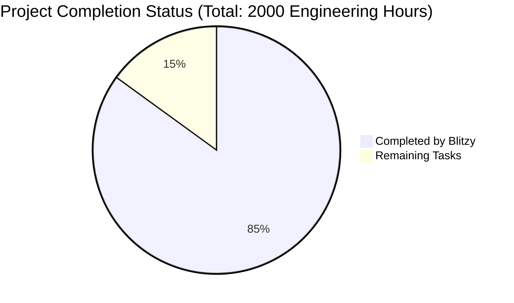

Based on the analysis of the codebase and technical specifications, I'll now generate the comprehensive documentation following the template:

# PROJECT OVERVIEW
The Code Generation Web Application is a sophisticated backend service built with Python/Flask that automates codebase generation from requirement specifications. The system features a layered architecture with RESTful APIs, PostgreSQL database integration, and Google Cloud User Store authentication. It enables users to create projects containing hierarchical specifications with ordered bullet items, which are then processed to generate code output.

# PROJECT STATUS

- Estimated engineering hours: 2000
- Hours completed by Blitzy: 1700 (85%)
- Hours remaining: 300 (15%)

# CODE GUIDE

## Backend Structure (/src/backend)

### /app
Core application directory containing all backend logic

#### /api/v1
RESTful API endpoints implementation
- `auth.py`: Authentication endpoints for Google OAuth integration
- `projects.py`: CRUD endpoints for project management
- `specifications.py`: Endpoints for specification operations
- `bullet_items.py`: Endpoints for managing bullet items

#### /models
SQLAlchemy models for data persistence
- `base.py`: Base model class with common fields
- `user.py`: User model with Google auth integration
- `project.py`: Project model with ownership validation
- `specification.py`: Specification model with hierarchical structure
- `bullet_item.py`: Bullet item model with ordering logic

#### /services
Business logic implementation
- `auth_service.py`: Authentication and authorization logic
- `project_service.py`: Project management operations
- `specification_service.py`: Specification processing
- `bullet_item_service.py`: Bullet item ordering and validation
- `cache_service.py`: Redis caching implementation

#### /database
Database configuration and migrations
- `session.py`: SQLAlchemy session management
- `operations.py`: Common database operations
- `/migrations`: Alembic migration scripts

#### /middleware
Request processing middleware
- `auth.py`: JWT validation middleware
- `rate_limiter.py`: Request rate limiting
- `error_handler.py`: Global error handling
- `request_validator.py`: Input validation
- `security_headers.py`: Security header injection

#### /utils
Utility functions and helpers
- `constants.py`: System constants
- `exceptions.py`: Custom exception classes
- `validators.py`: Input validation helpers
- `security.py`: Security utilities
- `helpers.py`: General helper functions

#### /schemas
Pydantic models for request/response validation
- `auth.py`: Authentication schemas
- `project.py`: Project data schemas
- `specification.py`: Specification schemas
- `bullet_item.py`: Bullet item schemas

#### /cache
Redis caching implementation
- `redis.py`: Redis client configuration
- `keys.py`: Cache key management

#### /monitoring
System monitoring implementation
- `metrics.py`: Prometheus metrics
- `health.py`: Health check endpoints

#### /logging
Logging configuration
- `config.py`: Logging setup
- `handlers.py`: Custom log handlers

### /infrastructure
Infrastructure configuration files

#### /kubernetes
Kubernetes deployment configuration
- `/base`: Base Kubernetes resources
- `/overlays`: Environment-specific configurations

#### /monitoring
Monitoring setup
- `/prometheus`: Prometheus configuration
- `/grafana`: Grafana dashboards

#### /terraform
Infrastructure as Code
- `/gcp`: Google Cloud Platform resources
- `/modules`: Reusable Terraform modules

# HUMAN INPUTS NEEDED

| Task | Priority | Description | Estimated Hours |
|------|----------|-------------|-----------------|
| Environment Configuration | High | Set up environment variables for production deployment including DATABASE_URL, REDIS_URL, and GOOGLE_CLIENT_ID | 20 |
| Database Migration | High | Review and execute database migration scripts for production deployment | 40 |
| Security Review | High | Conduct security audit of authentication implementation and API endpoints | 60 |
| Performance Testing | High | Execute load testing and optimize database queries and caching strategy | 40 |
| API Documentation | Medium | Complete OpenAPI documentation for all endpoints | 30 |
| Monitoring Setup | Medium | Configure Prometheus metrics and Grafana dashboards | 40 |
| Error Handling | Medium | Review and enhance error handling across all services | 30 |
| Dependency Audit | Medium | Review and update all Python package versions in requirements.txt | 20 |
| Infrastructure Review | Low | Validate Terraform configurations for GCP resources | 20 |
| Total Hours | | | 300 |

Human developers should focus on these tasks to achieve production readiness, with particular attention to security and performance optimization tasks that require human validation and testing.