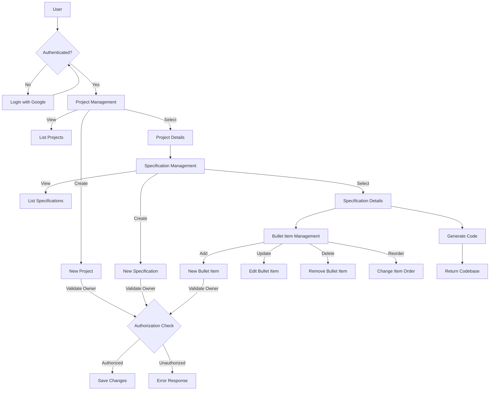
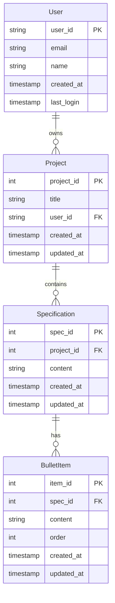
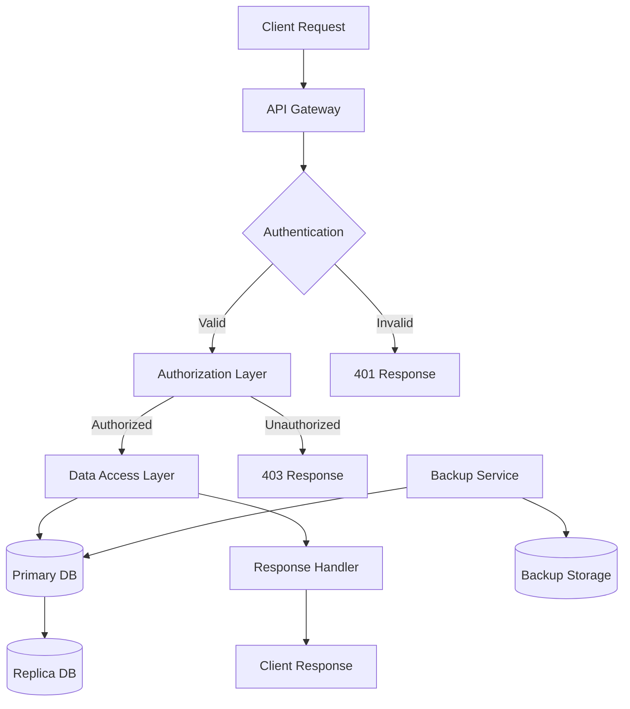
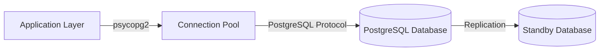
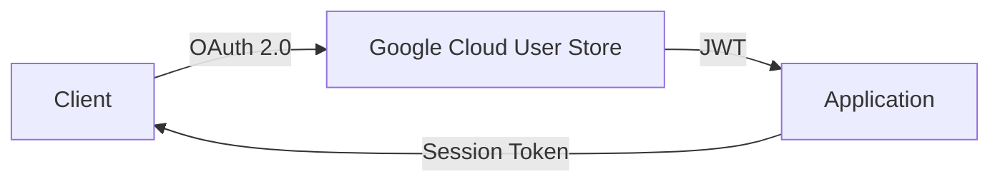

# 1. Introduction

## 1.1 Purpose

This Software Requirements Specification (SRS) document provides a comprehensive description of the requirements for developing a web-based code generation system. The document is intended for software developers, system architects, project managers, and stakeholders involved in the development and implementation of the system. It serves as a foundation for the technical agreement between development team members and will be used to validate the final implementation.

## 1.2 Scope

The system is a web application that enables users to generate codebase from requirement specifications. The application consists of:

- A RESTful backend service built with Python and Flask
- PostgreSQL database for data persistence
- Google Cloud User Store integration for authentication
- API endpoints for managing projects, specifications, and bullet items

Key functionalities include:

- User authentication and authorization
- Project management with single-user ownership
- Specification creation and management within projects
- Hierarchical organization of bullet items within specifications
- Code generation based on requirement specifications

The system does not include:

- Code deployment capabilities
- Version control integration
- Collaborative editing features
- Code execution or testing functionality

# 2. Product Description

## 2.1 Product Perspective

The code generation system operates as a standalone web application that interfaces with several external systems:

- Google Cloud User Store for authentication services
- PostgreSQL database for persistent data storage
- RESTful API endpoints for client-server communication

The system architecture follows a client-server model where:
- Frontend clients communicate with the backend through HTTP/REST protocols
- Backend services handle business logic and data persistence
- External authentication is managed through Google Cloud infrastructure

## 2.2 Product Functions

The primary functions of the system include:

- User Authentication
  - Login via Google Cloud User Store
  - Session management
  - Logout functionality

- Project Management
  - Create new projects with titles
  - List user's owned projects
  - Update project details
  - Delete projects

- Specification Management
  - Create specifications within projects
  - Retrieve specifications by ID
  - Update specification content
  - Delete specifications
  - Associate specifications with projects

- Bullet Item Management
  - Add ordered bullet items to specifications
  - Retrieve bullet items by ID
  - Update bullet item content
  - Delete bullet items
  - Maintain bullet item order

- Code Generation
  - Generate code based on specifications
  - Process hierarchical bullet items
  - Return generated codebase

## 2.3 User Characteristics

The system is designed for the following user types:

1. Software Developers
   - Technical expertise in software development
   - Familiarity with requirement specifications
   - Need to quickly generate code scaffolding

2. Technical Architects
   - Deep understanding of system design
   - Create high-level specifications
   - Review generated code structure

3. Project Managers
   - Oversee project requirements
   - Monitor specification progress
   - Limited technical expertise

## 2.4 Constraints

1. Technical Constraints
   - Maximum 10 bullet items per specification
   - Single user ownership per project
   - Google Cloud User Store dependency
   - RESTful API architecture requirements
   - PostgreSQL database compatibility

2. Security Constraints
   - Authentication required for all operations
   - Project access limited to owner
   - Secure data transmission requirements

3. System Constraints
   - Web browser compatibility
   - Network connectivity requirement
   - API response time limitations

## 2.5 Assumptions and Dependencies

Assumptions:
- Users have stable internet connectivity
- Users have modern web browsers
- Users have Google accounts for authentication
- Single user access pattern for projects

Dependencies:
- Google Cloud User Store availability
- PostgreSQL database system
- Python runtime environment
- Flask framework and dependencies
- Network infrastructure
- Client-side JavaScript support

## 2.6 Process Flowchart



# 3. Functional Requirements

## 3.1 User Authentication

### ID: FR-1
### Description
User authentication functionality using Google Cloud User Store
### Priority
High
### Requirements

| ID | Requirement | Input | Process | Output |
|----|-------------|--------|---------|---------|
| FR-1.1 | User Login | Google credentials | Authenticate via Google Cloud User Store | JWT token, User session |
| FR-1.2 | User Logout | JWT token | Invalidate session | Confirmation message |
| FR-1.3 | Session Validation | JWT token | Verify token validity | Authentication status |

## 3.2 Project Management

### ID: FR-2
### Description
CRUD operations for projects with ownership validation
### Priority
High
### Requirements

| ID | Requirement | Input | Process | Output |
|----|-------------|--------|---------|---------|
| FR-2.1 | Create Project | Project title, User ID | Validate user, Create project record | Project ID, details |
| FR-2.2 | List Projects | User ID | Query user's projects | List of projects |
| FR-2.3 | Update Project | Project ID, New title | Validate ownership, Update record | Updated project details |
| FR-2.4 | Delete Project | Project ID | Validate ownership, Delete project | Confirmation message |

## 3.3 Specification Management

### ID: FR-3
### Description
CRUD operations for specifications within projects
### Priority
High
### Requirements

| ID | Requirement | Input | Process | Output |
|----|-------------|--------|---------|---------|
| FR-3.1 | Create Specification | Project ID, Spec text | Validate project ownership, Create spec | Specification ID, details |
| FR-3.2 | List Specifications | Project ID | Validate ownership, Query specs | List of specifications |
| FR-3.3 | Update Specification | Spec ID, New text | Validate ownership, Update spec | Updated specification |
| FR-3.4 | Delete Specification | Spec ID | Validate ownership, Delete spec | Confirmation message |

## 3.4 Bullet Item Management

### ID: FR-4
### Description
CRUD operations for bullet items within specifications
### Priority
Medium
### Requirements

| ID | Requirement | Input | Process | Output |
|----|-------------|--------|---------|---------|
| FR-4.1 | Add Bullet Item | Spec ID, Item text, Order | Validate count < 10, Create item | Item ID, details |
| FR-4.2 | List Bullet Items | Spec ID | Query items, Sort by order | Ordered list of items |
| FR-4.3 | Update Bullet Item | Item ID, New text | Validate ownership, Update item | Updated item details |
| FR-4.4 | Delete Bullet Item | Item ID | Validate ownership, Delete item | Confirmation message |
| FR-4.5 | Reorder Items | Spec ID, Item IDs, New orders | Update item orders | Updated order confirmation |

## 3.5 Code Generation

### ID: FR-5
### Description
Generate code based on specifications and bullet items
### Priority
High
### Requirements

| ID | Requirement | Input | Process | Output |
|----|-------------|--------|---------|---------|
| FR-5.1 | Generate Code | Project ID | Process specs and items, Generate code | Generated codebase |
| FR-5.2 | Validate Input | Specification content | Check format and constraints | Validation status |
| FR-5.3 | Process Hierarchy | Bullet items | Parse item relationships | Structured data |

# 4. Non-Functional Requirements

## 4.1 Performance Requirements

| Requirement ID | Description | Target Metric |
|---------------|-------------|---------------|
| NFR-1.1 | API Response Time | 95% of requests complete within 500ms |
| NFR-1.2 | Database Query Performance | Average query execution time < 100ms |
| NFR-1.3 | Concurrent Users | Support 100 simultaneous users |
| NFR-1.4 | Code Generation Time | Complete within 5 seconds for projects with up to 10 specifications |
| NFR-1.5 | Resource Usage | Maximum 2GB RAM per server instance |

## 4.2 Safety Requirements

| Requirement ID | Description | Implementation |
|---------------|-------------|----------------|
| NFR-2.1 | Data Backup | Daily automated backups of PostgreSQL database |
| NFR-2.2 | Error Recovery | Automatic rollback of failed transactions |
| NFR-2.3 | System State Monitoring | Health check endpoints with 1-minute intervals |
| NFR-2.4 | Data Validation | Input validation for all API endpoints |
| NFR-2.5 | Failure Isolation | Separate process spaces for different system components |

## 4.3 Security Requirements

| Requirement ID | Description | Implementation |
|---------------|-------------|----------------|
| NFR-3.1 | Authentication | OAuth 2.0 via Google Cloud User Store |
| NFR-3.2 | Authorization | Role-based access control for project resources |
| NFR-3.3 | Data Encryption | TLS 1.3 for data in transit |
| NFR-3.4 | Session Management | JWT with 24-hour expiration |
| NFR-3.5 | API Security | Rate limiting of 100 requests per minute per user |
| NFR-3.6 | Data Privacy | User data isolation in database schema |

## 4.4 Quality Requirements

### 4.4.1 Availability
- System uptime of 99.9% excluding planned maintenance
- Maximum planned downtime of 4 hours per month
- Automatic failover for critical components

### 4.4.2 Maintainability
- Modular architecture with clear separation of concerns
- Comprehensive API documentation using OpenAPI 3.0
- Code coverage minimum of 80% for unit tests
- Automated deployment pipeline

### 4.4.3 Usability
- RESTful API endpoints following standard conventions
- Consistent error response format
- Clear validation messages for invalid inputs
- API versioning support

### 4.4.4 Scalability
- Horizontal scaling capability for API servers
- Database connection pooling with maximum 100 connections
- Caching layer for frequently accessed data
- Stateless application design

### 4.4.5 Reliability
- Maximum 0.1% error rate for API requests
- Automatic retry mechanism for failed operations
- Circuit breaker pattern for external service calls
- Regular health checks for all system components

## 4.5 Compliance Requirements

| Requirement ID | Description | Standard/Regulation |
|---------------|-------------|-------------------|
| NFR-5.1 | Data Protection | GDPR compliance for EU users |
| NFR-5.2 | API Documentation | OpenAPI Specification 3.0 |
| NFR-5.3 | Code Style | PEP 8 Python style guide |
| NFR-5.4 | Authentication | OAuth 2.0 standards |
| NFR-5.5 | API Design | REST architectural constraints |
| NFR-5.6 | Error Handling | RFC 7807 Problem Details standard |

# 5. Data Requirements

## 5.1 Data Models



## 5.2 Data Storage

### 5.2.1 Database Schema

| Table | Primary Key | Foreign Keys | Indexes |
|-------|-------------|--------------|----------|
| users | user_id | - | email |
| projects | project_id | user_id | user_id, created_at |
| specifications | spec_id | project_id | project_id, created_at |
| bullet_items | item_id | spec_id | spec_id, order |

### 5.2.2 Data Retention

- User data: Retained indefinitely
- Project data: Retained for 7 years after last access
- Soft deletion for all entities with deletion_timestamp
- Daily incremental backups retained for 30 days
- Weekly full backups retained for 1 year

### 5.2.3 Redundancy and Backup

- PostgreSQL synchronous replication with one standby
- Point-in-time recovery capability up to 7 days
- Geographic redundancy across two regions
- Automated backup verification daily
- Recovery time objective (RTO): 1 hour
- Recovery point objective (RPO): 5 minutes

## 5.3 Data Processing

### 5.3.1 Data Flow



### 5.3.2 Data Security

| Layer | Security Measure |
|-------|-----------------|
| Transport | TLS 1.3 encryption |
| Application | Input sanitization, Prepared statements |
| Database | Row-level security, Column encryption |
| Backup | AES-256 encryption at rest |
| Access Control | Role-based access control (RBAC) |

### 5.3.3 Data Validation Rules

| Entity | Field | Validation Rule |
|--------|-------|----------------|
| Project | title | Required, 1-100 characters |
| Specification | content | Required, max 5000 characters |
| BulletItem | content | Required, max 1000 characters |
| BulletItem | order | Required, 0-9 range |
| User | email | Valid email format |

# 6. External Interfaces

## 6.1 User Interfaces

The system provides a RESTful API interface that can be consumed by any frontend client. No specific user interface requirements are defined as the system operates as a backend service.

## 6.2 Software Interfaces

| Interface | Description | Protocol | Data Format |
|-----------|-------------|----------|-------------|
| Google Cloud User Store | Authentication service | HTTPS/OAuth 2.0 | JSON |
| PostgreSQL Database | Data persistence | PostgreSQL Protocol | SQL |
| Flask Web Server | Application server | HTTP/HTTPS | JSON |
| RESTful API | Client communication | HTTP/HTTPS | JSON |

### 6.2.1 Database Interface Specifications



### 6.2.2 Authentication Interface Specifications



## 6.3 Communication Interfaces

### 6.3.1 API Endpoints

| Endpoint | Method | Content-Type | Authentication |
|----------|---------|--------------|----------------|
| /api/v1/* | GET, POST, PUT, DELETE | application/json | Bearer Token |
| /auth/* | POST | application/json | None |
| /health | GET | application/json | None |

### 6.3.2 Network Protocols

| Protocol | Port | Usage |
|----------|------|-------|
| HTTPS | 443 | API Communication |
| PostgreSQL | 5432 | Database Connection |
| HTTP | 80 | Redirect to HTTPS |

### 6.3.3 Data Exchange Format

```json
{
  "content-type": "application/json",
  "charset": "UTF-8",
  "error-format": {
    "code": "string",
    "message": "string",
    "details": "object"
  },
  "authentication": {
    "type": "Bearer",
    "token": "JWT"
  }
}
```

# APPENDICES

## A.1 Glossary

| Term | Definition |
|------|------------|
| Bullet Item | A text entry within a specification that represents a single requirement or detail |
| Codebase | The complete collection of source code generated from specifications |
| JWT | JSON Web Token used for secure transmission of information between parties |
| Owner | The user who created and has exclusive write access to a project |
| Project | A container for related specifications with a title and single owner |
| Specification | A text document containing requirement details organized as bullet items |

## A.2 Acronyms

| Acronym | Definition |
|---------|------------|
| API | Application Programming Interface |
| CRUD | Create, Read, Update, Delete |
| GDPR | General Data Protection Regulation |
| HTTP | Hypertext Transfer Protocol |
| HTTPS | Hypertext Transfer Protocol Secure |
| JWT | JSON Web Token |
| OAuth | Open Authorization |
| REST | Representational State Transfer |
| RTO | Recovery Time Objective |
| RPO | Recovery Point Objective |
| SQL | Structured Query Language |
| TLS | Transport Layer Security |
| URL | Uniform Resource Locator |

## A.3 Additional References

| Reference | Description | URL |
|-----------|-------------|-----|
| Flask Documentation | Official Flask web framework documentation | https://flask.palletsprojects.com/ |
| Google Cloud Identity Platform | Authentication service documentation | https://cloud.google.com/identity-platform/docs |
| OAuth 2.0 Specification | Authentication protocol specification | https://oauth.net/2/ |
| OpenAPI Specification | REST API documentation standard | https://swagger.io/specification/ |
| PostgreSQL Documentation | Database system documentation | https://www.postgresql.org/docs/ |
| Python PEP 8 | Style guide for Python code | https://pep8.org/ |
| RFC 7807 | Problem Details for HTTP APIs | https://tools.ietf.org/html/rfc7807 |