# 1. Introduction

## 1.1 System Overview

The Code Generation Web Application is a comprehensive software system designed to automate the process of generating codebase from requirement specifications. The system consists of a RESTful backend service built with Python and Flask, integrated with PostgreSQL for data persistence and Google Cloud User Store for authentication.

The backend architecture follows a layered approach:

1. API Layer: RESTful endpoints handling HTTP requests and responses
2. Authentication Layer: Google Cloud User Store integration for secure user management
3. Business Logic Layer: Core functionality for project, specification, and bullet item management
4. Data Access Layer: PostgreSQL database interactions for persistent storage
5. Code Generation Layer: Processing specifications to generate codebase output

Key system components include:

- Flask web server handling REST API requests
- PostgreSQL database with synchronous replication
- Google Cloud User Store authentication service
- JWT-based session management
- Data validation and security middleware

## 1.2 Scope

The system encompasses the following core functionalities:

1. User Management
   - Secure authentication through Google Cloud User Store
   - Session management with JWT tokens
   - User-specific project ownership

2. Project Organization
   - Creation and management of projects
   - Single-user ownership model
   - Project-level access control

3. Specification Management
   - Hierarchical organization of specifications
   - Support for up to 10 ordered bullet items per specification
   - Unique identification system for specifications and items

4. Data Management
   - CRUD operations for projects, specifications, and bullet items
   - Data validation and constraint enforcement
   - Secure data access patterns

5. Code Generation
   - Processing of specification content
   - Transformation of requirements into codebase
   - Structured output generation

The system specifically excludes:
- Frontend implementation
- Code deployment functionality
- Version control system integration
- Multi-user collaboration features
- Code execution capabilities
- Testing framework generation

# 7. System Architecture

## 7.1 High-Level Architecture

```mermaid
flowchart TB
    subgraph Client Layer
        CL[Client Applications]
    end

    subgraph API Gateway Layer
        AG[API Gateway]
        RT[Rate Limiter]
        LB[Load Balancer]
    end

    subgraph Application Layer
        subgraph Service Components
            AS[Authentication Service]
            PS[Project Service]
            SS[Specification Service]
            BS[Bullet Item Service]
            CS[Code Generation Service]
        end
        
        subgraph Core Components
            VAL[Validation Layer]
            SEC[Security Layer]
            LOG[Logging System]
            CACHE[Cache Manager]
        end
    end

    subgraph External Services
        GC[Google Cloud User Store]
    end

    subgraph Data Layer
        subgraph Database Cluster
            PG[(PostgreSQL Primary)]
            SR[(PostgreSQL Replica)]
        end
        REDIS[(Redis Cache)]
    end

    CL --> AG
    AG --> RT
    RT --> LB
    LB --> Service Components
    Service Components --> Core Components
    AS --> GC
    Service Components --> CACHE
    CACHE --> REDIS
    Service Components --> PG
    PG --> SR
```

## 7.2 Component Architecture

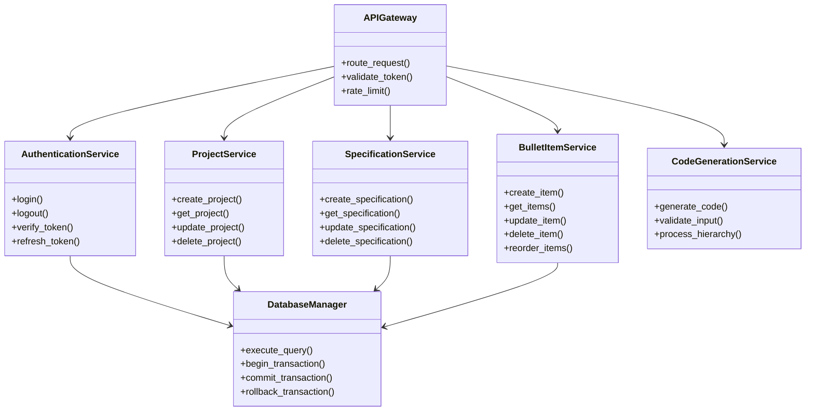

## 7.3 Data Flow Architecture

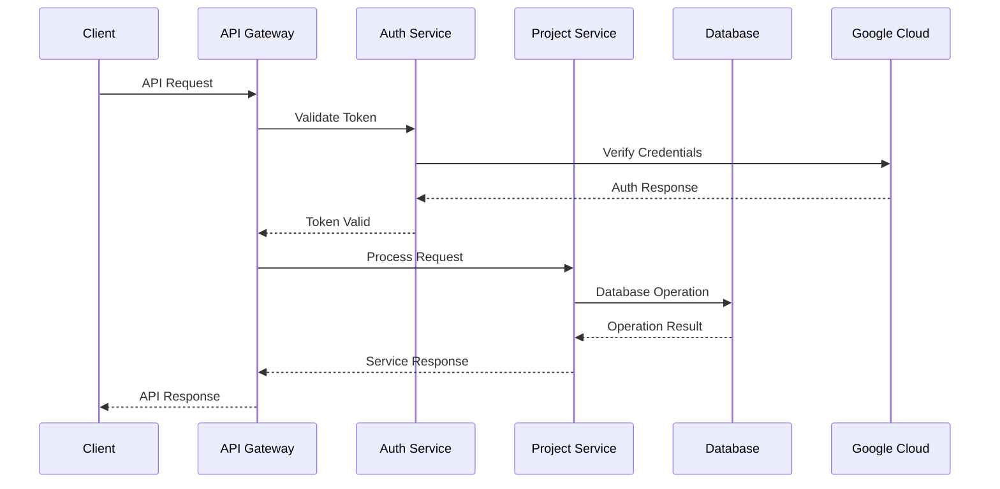

## 7.4 Deployment Architecture

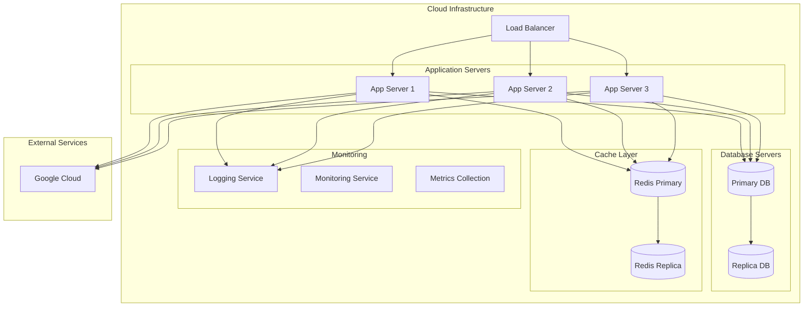

## 7.5 Technology Stack

| Layer | Technology |
|-------|------------|
| Web Server | Flask 2.0+ |
| Database | PostgreSQL 14+ |
| Cache | Redis 6+ |
| Authentication | Google Cloud User Store |
| API Documentation | OpenAPI 3.0 |
| Load Balancing | NGINX |
| Monitoring | Prometheus & Grafana |
| Logging | ELK Stack |
| Container Runtime | Docker |
| Container Orchestration | Kubernetes |

## 7.6 Security Architecture

```mermaid
flowchart TB
    subgraph Security Layers
        direction TB
        L1[Network Security Layer]
        L2[Application Security Layer]
        L3[Data Security Layer]
        
        subgraph Network Controls
            FW[Firewall]
            WAF[Web Application Firewall]
            DDoS[DDoS Protection]
        end
        
        subgraph Application Controls
            AUTH[Authentication]
            AUTHZ[Authorization]
            VAL[Input Validation]
            SESS[Session Management]
        end
        
        subgraph Data Controls
            ENC[Encryption]
            MASK[Data Masking]
            ACC[Access Control]
            AUD[Audit Logging]
        end
    end
    
    L1 --> Network Controls
    L2 --> Application Controls
    L3 --> Data Controls
```

# 8. System Components

## 8.1 Component Diagrams

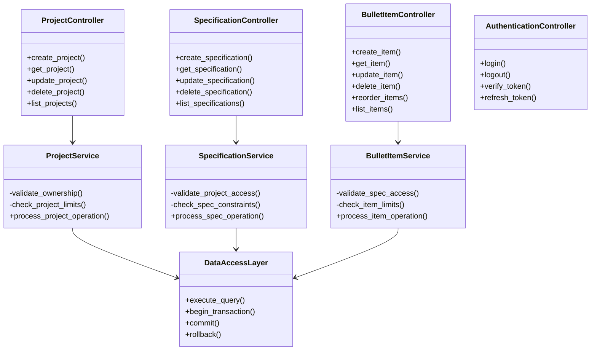

## 8.2 Sequence Diagrams

### 8.2.1 Project Creation Flow

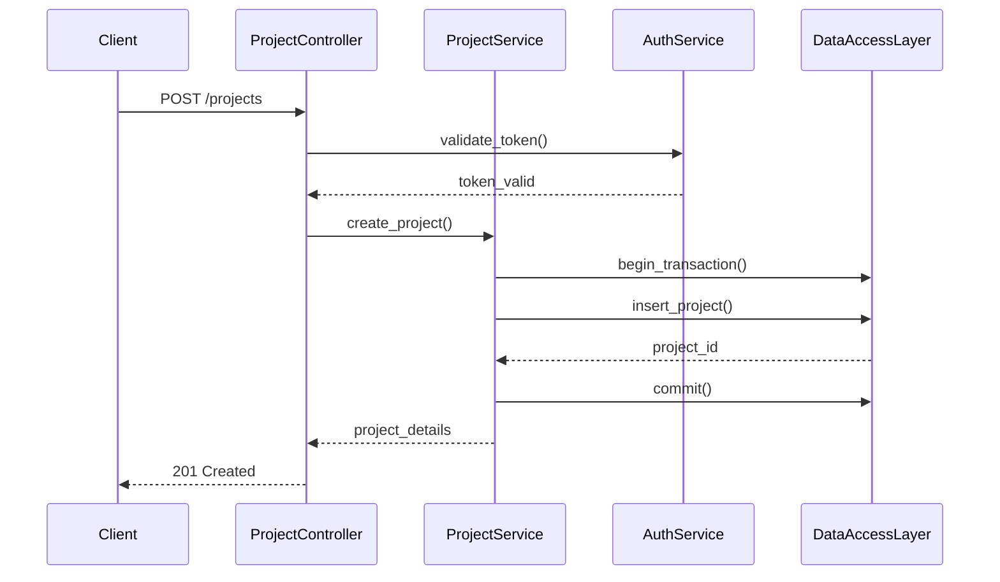

### 8.2.2 Specification Management Flow

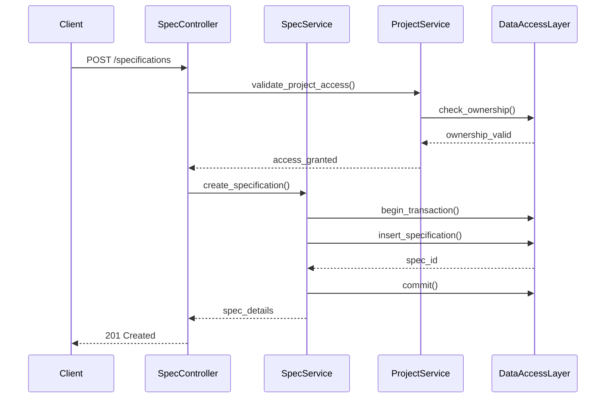

### 8.2.3 Bullet Item Management Flow

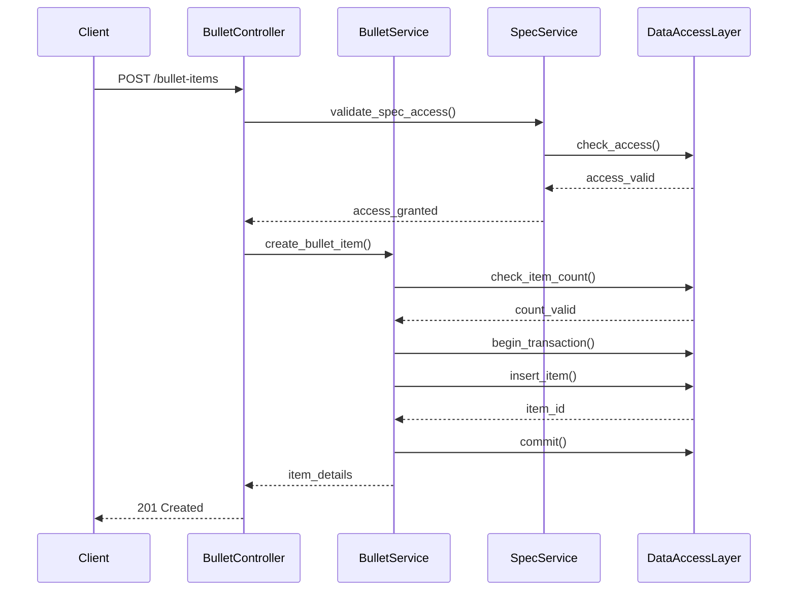

## 8.3 Data Flow Diagram

```mermaid
flowchart TD
    subgraph Client Layer
        CL[Client Request]
    end
    
    subgraph API Layer
        API[API Endpoint]
        Auth[Authentication]
        Val[Validation]
    end
    
    subgraph Service Layer
        PS[Project Service]
        SS[Specification Service]
        BS[Bullet Service]
    end
    
    subgraph Data Layer
        DAL[Data Access Layer]
        Cache[Redis Cache]
        DB[(PostgreSQL)]
    end
    
    CL -->|HTTP Request| API
    API -->|Validate| Auth
    Auth -->|Authorize| Val
    Val -->|Process| Service Layer
    
    PS -->|Query/Update| DAL
    SS -->|Query/Update| DAL
    BS -->|Query/Update| DAL
    
    DAL -->|Cache Check| Cache
    Cache -->|Miss| DB
    DAL -->|Direct Access| DB
    DB -->|Result| DAL
    DAL -->|Response| Service Layer
    Service Layer -->|Result| API
    API -->|HTTP Response| CL
```

## 8.4 Component Dependencies

| Component | Dependencies | Purpose |
|-----------|--------------|---------|
| Controllers | Authentication Service, Services | Request handling and routing |
| Services | Data Access Layer, Cache | Business logic implementation |
| Data Access Layer | PostgreSQL, Redis | Data persistence and caching |
| Authentication | Google Cloud User Store | User identity management |
| Validation | None | Input validation and sanitization |
| Cache Manager | Redis | Performance optimization |
| Error Handler | Logging Service | Error management and reporting |

## 8.5 Component Communication Protocols

| Source Component | Target Component | Protocol | Format |
|-----------------|------------------|----------|---------|
| Client | API Controllers | HTTPS/REST | JSON |
| Controllers | Services | Internal | Python Objects |
| Services | Data Access Layer | Internal | SQL/Python Objects |
| Data Access Layer | PostgreSQL | PostgreSQL Protocol | SQL |
| Services | Cache | Redis Protocol | Key-Value Pairs |
| Authentication | Google Cloud | HTTPS/OAuth | JWT |

# 9. Technology Stack

## 9.1 Programming Languages

| Language | Version | Purpose | Justification |
|----------|---------|---------|---------------|
| Python | 3.9+ | Backend Development | - Strong ecosystem for web development<br>- Extensive library support<br>- Excellent data processing capabilities<br>- Clean and maintainable code |
| SQL | PostgreSQL 14+ | Database Queries | - Robust query capabilities<br>- ACID compliance<br>- Complex data relationships |

## 9.2 Frameworks and Libraries

| Category | Technology | Version | Purpose |
|----------|------------|---------|----------|
| Web Framework | Flask | 2.0+ | - RESTful API development<br>- Lightweight and flexible<br>- Extensive middleware support |
| ORM | SQLAlchemy | 1.4+ | - Database abstraction<br>- Query building<br>- Migration management |
| Authentication | Google Cloud Auth | Latest | - User authentication<br>- Token management |
| API Documentation | Flask-OpenAPI | 3.0+ | - API documentation<br>- Schema validation |
| Testing | pytest | 6.0+ | - Unit testing<br>- Integration testing |
| Validation | marshmallow | 3.0+ | - Request/response validation<br>- Schema enforcement |

## 9.3 Databases

### Primary Database

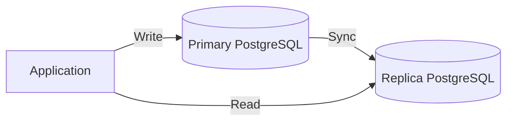

| Database | Version | Purpose | Features |
|----------|---------|---------|----------|
| PostgreSQL | 14+ | Primary Data Store | - ACID compliance<br>- Complex queries<br>- Robust replication<br>- JSON support |
| Redis | 6+ | Caching Layer | - Session storage<br>- Query caching<br>- Rate limiting |

## 9.4 Third-Party Services

| Service | Purpose | Integration Method |
|---------|---------|-------------------|
| Google Cloud User Store | User Authentication | OAuth 2.0 / REST API |
| Google Cloud Storage | Backup Storage | Cloud Storage API |
| Google Cloud Monitoring | System Monitoring | Monitoring API |

### Service Integration Architecture

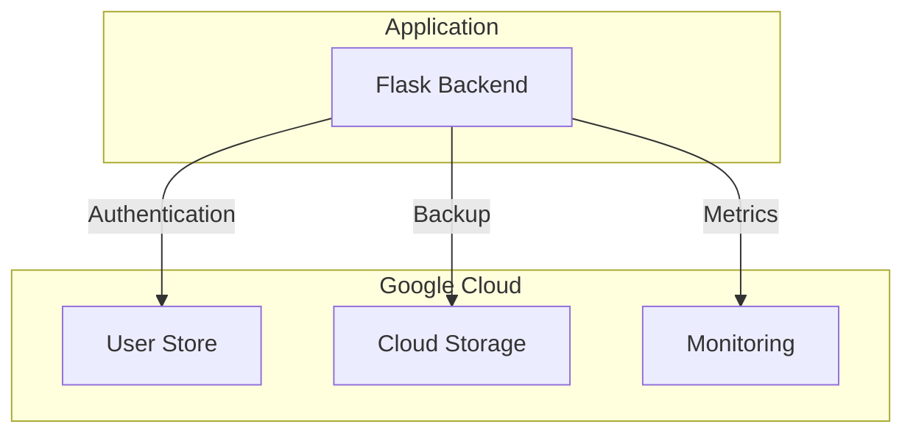

## 9.5 Development and Deployment Tools

| Category | Tool | Version | Purpose |
|----------|------|---------|----------|
| Container Runtime | Docker | 20.10+ | Application containerization |
| Container Orchestration | Kubernetes | 1.24+ | Container management |
| CI/CD | Jenkins | 2.0+ | Automated deployment |
| Version Control | Git | 2.0+ | Source code management |
| Code Quality | SonarQube | 9.0+ | Code analysis |

Based on the existing Technical Specifications document, I'll generate the SYSTEM DESIGN section focusing on API DESIGN and DATABASE DESIGN since this is a backend service without a user interface. I'll maintain consistency with the Python/Flask/PostgreSQL stack and existing architecture decisions.

# 2. System Design

## 2.1 API Design

### 2.1.1 Authentication Endpoints

| Endpoint | Method | Description | Request Body | Response |
|----------|--------|-------------|--------------|-----------|
| /api/v1/auth/login | POST | Login with Google | `{"token": "google_token"}` | `{"jwt": "token", "expires_at": "timestamp"}` |
| /api/v1/auth/logout | POST | Logout user | None | `{"message": "success"}` |
| /api/v1/auth/refresh | POST | Refresh JWT | `{"refresh_token": "token"}` | `{"jwt": "new_token"}` |

### 2.1.2 Project Endpoints

| Endpoint | Method | Description | Request Body | Response |
|----------|--------|-------------|--------------|-----------|
| /api/v1/projects | GET | List user's projects | None | `{"projects": [...]}` |
| /api/v1/projects | POST | Create project | `{"title": "string"}` | `{"project_id": int, ...}` |
| /api/v1/projects/{id} | GET | Get project details | None | `{"project": {...}}` |
| /api/v1/projects/{id} | PUT | Update project | `{"title": "string"}` | `{"project": {...}}` |
| /api/v1/projects/{id} | DELETE | Delete project | None | `{"message": "success"}` |

### 2.1.3 Specification Endpoints

| Endpoint | Method | Description | Request Body | Response |
|----------|--------|-------------|--------------|-----------|
| /api/v1/projects/{id}/specs | GET | List specifications | None | `{"specifications": [...]}` |
| /api/v1/projects/{id}/specs | POST | Create specification | `{"content": "string"}` | `{"spec_id": int, ...}` |
| /api/v1/specs/{id} | GET | Get specification | None | `{"specification": {...}}` |
| /api/v1/specs/{id} | PUT | Update specification | `{"content": "string"}` | `{"specification": {...}}` |
| /api/v1/specs/{id} | DELETE | Delete specification | None | `{"message": "success"}` |

### 2.1.4 Bullet Item Endpoints

| Endpoint | Method | Description | Request Body | Response |
|----------|--------|-------------|--------------|-----------|
| /api/v1/specs/{id}/items | GET | List bullet items | None | `{"items": [...]}` |
| /api/v1/specs/{id}/items | POST | Create bullet item | `{"content": "string", "order": int}` | `{"item_id": int, ...}` |
| /api/v1/items/{id} | GET | Get bullet item | None | `{"item": {...}}` |
| /api/v1/items/{id} | PUT | Update bullet item | `{"content": "string", "order": int}` | `{"item": {...}}` |
| /api/v1/items/{id} | DELETE | Delete bullet item | None | `{"message": "success"}` |
| /api/v1/specs/{id}/items/reorder | PUT | Reorder items | `{"orders": [{"id": int, "order": int}]}` | `{"items": [...]}` |

## 2.2 Database Design

### 2.2.1 Entity Relationship Diagram

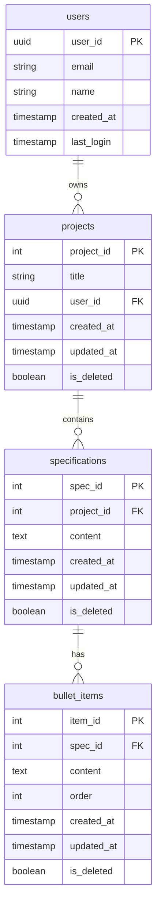

### 2.2.2 Database Schema

```sql
CREATE TABLE users (
    user_id UUID PRIMARY KEY,
    email VARCHAR(255) NOT NULL UNIQUE,
    name VARCHAR(255) NOT NULL,
    created_at TIMESTAMP WITH TIME ZONE DEFAULT CURRENT_TIMESTAMP,
    last_login TIMESTAMP WITH TIME ZONE
);

CREATE TABLE projects (
    project_id SERIAL PRIMARY KEY,
    title VARCHAR(100) NOT NULL,
    user_id UUID NOT NULL REFERENCES users(user_id),
    created_at TIMESTAMP WITH TIME ZONE DEFAULT CURRENT_TIMESTAMP,
    updated_at TIMESTAMP WITH TIME ZONE DEFAULT CURRENT_TIMESTAMP,
    is_deleted BOOLEAN DEFAULT FALSE,
    CONSTRAINT valid_title CHECK (LENGTH(TRIM(title)) > 0)
);

CREATE TABLE specifications (
    spec_id SERIAL PRIMARY KEY,
    project_id INTEGER NOT NULL REFERENCES projects(project_id),
    content TEXT NOT NULL,
    created_at TIMESTAMP WITH TIME ZONE DEFAULT CURRENT_TIMESTAMP,
    updated_at TIMESTAMP WITH TIME ZONE DEFAULT CURRENT_TIMESTAMP,
    is_deleted BOOLEAN DEFAULT FALSE,
    CONSTRAINT valid_content CHECK (LENGTH(TRIM(content)) > 0)
);

CREATE TABLE bullet_items (
    item_id SERIAL PRIMARY KEY,
    spec_id INTEGER NOT NULL REFERENCES specifications(spec_id),
    content TEXT NOT NULL,
    order INTEGER NOT NULL,
    created_at TIMESTAMP WITH TIME ZONE DEFAULT CURRENT_TIMESTAMP,
    updated_at TIMESTAMP WITH TIME ZONE DEFAULT CURRENT_TIMESTAMP,
    is_deleted BOOLEAN DEFAULT FALSE,
    CONSTRAINT valid_order CHECK (order >= 0 AND order < 10),
    CONSTRAINT valid_content CHECK (LENGTH(TRIM(content)) > 0),
    UNIQUE (spec_id, order)
);
```

### 2.2.3 Indexes

```sql
-- Performance indexes
CREATE INDEX idx_projects_user_id ON projects(user_id) WHERE NOT is_deleted;
CREATE INDEX idx_specifications_project_id ON specifications(project_id) WHERE NOT is_deleted;
CREATE INDEX idx_bullet_items_spec_id ON bullet_items(spec_id) WHERE NOT is_deleted;
CREATE INDEX idx_bullet_items_order ON bullet_items(spec_id, order) WHERE NOT is_deleted;

-- Search indexes
CREATE INDEX idx_projects_title ON projects USING gin(to_tsvector('english', title)) WHERE NOT is_deleted;
CREATE INDEX idx_specifications_content ON specifications USING gin(to_tsvector('english', content)) WHERE NOT is_deleted;
```

# 10. Security Considerations

## 10.1 Authentication and Authorization

### 10.1.1 Authentication Flow

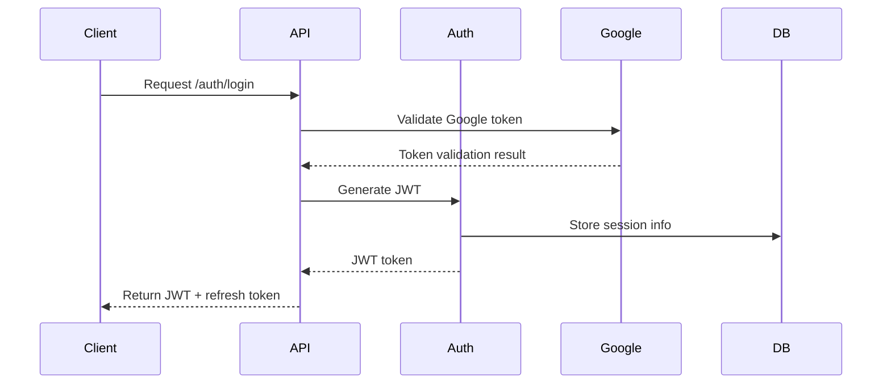

### 10.1.2 Authorization Matrix

| Resource | Action | Owner | Other Users | Unauthenticated |
|----------|--------|-------|-------------|-----------------|
| Project | Create | ✓ | ✗ | ✗ |
| Project | Read | ✓ | ✗ | ✗ |
| Project | Update | ✓ | ✗ | ✗ |
| Project | Delete | ✓ | ✗ | ✗ |
| Specification | Create | ✓ | ✗ | ✗ |
| Specification | Read | ✓ | ✗ | ✗ |
| Specification | Update | ✓ | ✗ | ✗ |
| Specification | Delete | ✓ | ✗ | ✗ |
| Bullet Item | Create | ✓ | ✗ | ✗ |
| Bullet Item | Read | ✓ | ✗ | ✗ |
| Bullet Item | Update | ✓ | ✗ | ✗ |
| Bullet Item | Delete | ✓ | ✗ | ✗ |

### 10.1.3 Token Management

| Token Type | Duration | Refresh Allowed | Storage Location |
|------------|----------|-----------------|------------------|
| Access JWT | 1 hour | No | Client memory |
| Refresh Token | 24 hours | Yes | HTTP-only cookie |
| Google Token | Variable | No | Temporary memory |

## 10.2 Data Security

### 10.2.1 Data Classification

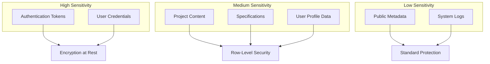

### 10.2.2 Encryption Standards

| Data Type | In Transit | At Rest | Key Management |
|-----------|------------|----------|----------------|
| User Credentials | TLS 1.3 | AES-256 | Google KMS |
| Session Tokens | TLS 1.3 | AES-256 | Application Keys |
| Project Data | TLS 1.3 | RLS + AES-256 | PostgreSQL |
| Application Logs | TLS 1.3 | AES-256 | System Keys |

### 10.2.3 Database Security

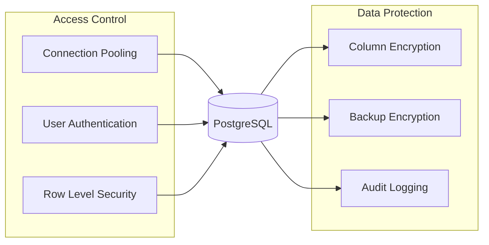

## 10.3 Security Protocols

### 10.3.1 Request Security

| Security Measure | Implementation | Purpose |
|-----------------|----------------|----------|
| Rate Limiting | 100 req/min per IP | Prevent brute force |
| Input Validation | Schema validation | Prevent injection |
| CORS | Whitelist domains | Prevent XSS |
| Content Security | Strict headers | Prevent XSS/CSRF |
| Request Size | 10MB limit | Prevent DoS |

### 10.3.2 Security Headers

```python
SECURITY_HEADERS = {
    'Strict-Transport-Security': 'max-age=31536000; includeSubDomains',
    'X-Content-Type-Options': 'nosniff',
    'X-Frame-Options': 'DENY',
    'X-XSS-Protection': '1; mode=block',
    'Content-Security-Policy': "default-src 'self'",
    'Referrer-Policy': 'strict-origin-when-cross-origin'
}
```

### 10.3.3 Security Monitoring

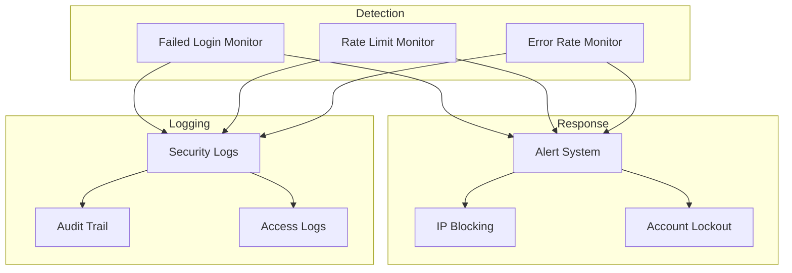

### 10.3.4 Security Compliance

| Requirement | Implementation | Validation |
|-------------|----------------|------------|
| Password Security | Google OAuth 2.0 | OAuth compliance |
| Data Privacy | Row-level isolation | Database audit |
| Access Control | JWT + RBAC | Permission tests |
| Data Encryption | TLS + AES-256 | Security scan |
| Audit Logging | Structured logs | Log analysis |
| Session Management | Secure cookies | Session tests |

### 10.3.5 Incident Response

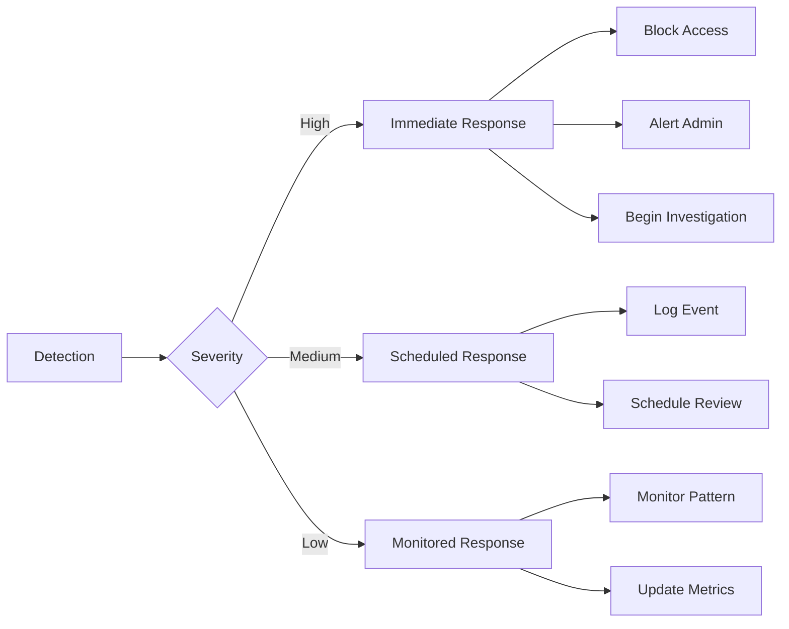

# 11. Infrastructure

## 11.1 Deployment Environment

The system will be deployed on Google Cloud Platform (GCP) to maintain consistency with the Google Cloud User Store authentication service and leverage GCP's managed services.

### 11.1.1 Environment Architecture

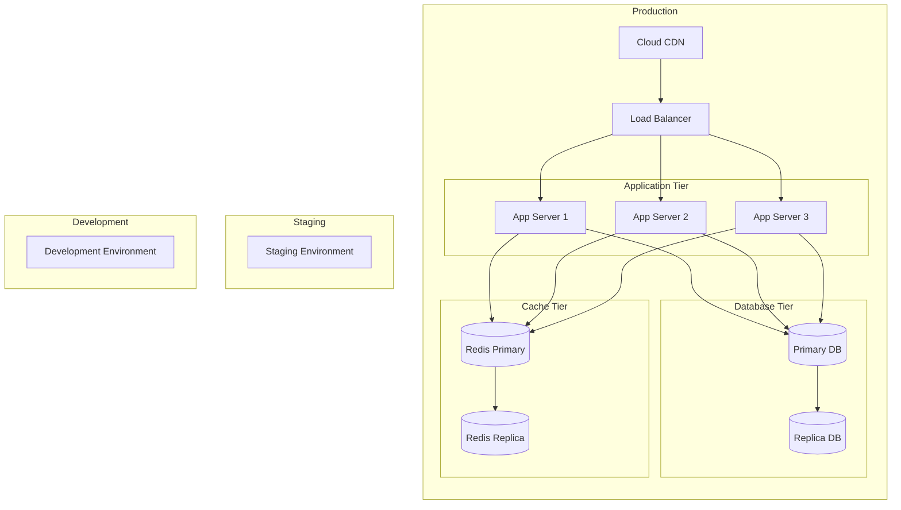

### 11.1.2 Environment Specifications

| Environment | Purpose | Specifications | Scaling |
|-------------|---------|----------------|----------|
| Production | Live system | 4 vCPU, 16GB RAM | Auto-scaling 3-10 instances |
| Staging | Pre-production testing | 2 vCPU, 8GB RAM | Fixed 2 instances |
| Development | Development testing | 2 vCPU, 4GB RAM | Single instance |

## 11.2 Cloud Services

### 11.2.1 Google Cloud Platform Services

| Service | Usage | Justification |
|---------|-------|---------------|
| Google Kubernetes Engine (GKE) | Container orchestration | Managed Kubernetes with auto-scaling |
| Cloud SQL | PostgreSQL database | Managed database with automatic failover |
| Cloud Memorystore | Redis cache | Managed Redis with high availability |
| Cloud Load Balancing | Traffic distribution | Global load balancing with SSL termination |
| Cloud CDN | Content delivery | Edge caching for static content |
| Cloud Identity Platform | Authentication | Integration with User Store |
| Cloud Storage | Backup storage | Durable object storage for backups |
| Cloud Monitoring | System monitoring | Integrated monitoring and alerting |
| Cloud Logging | Log management | Centralized logging solution |

### 11.2.2 Service Architecture

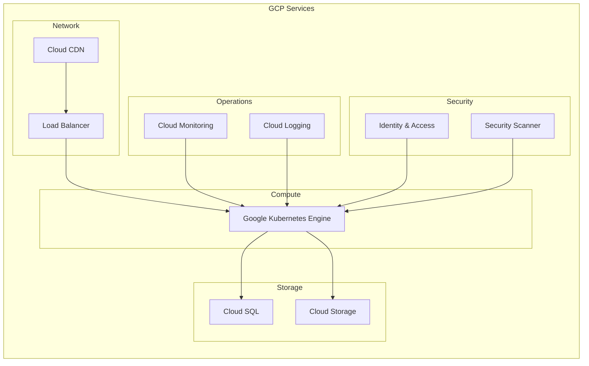

## 11.3 Containerization

### 11.3.1 Docker Configuration

```dockerfile
# Application Dockerfile
FROM python:3.9-slim

WORKDIR /app
COPY requirements.txt .
RUN pip install --no-cache-dir -r requirements.txt

COPY . .
EXPOSE 8000

CMD ["gunicorn", "--bind", "0.0.0.0:8000", "wsgi:app"]
```

### 11.3.2 Container Architecture

| Container | Base Image | Purpose | Resource Limits |
|-----------|------------|---------|-----------------|
| Application | python:3.9-slim | Flask application | CPU: 2, Memory: 4GB |
| Redis | redis:6-alpine | Caching layer | CPU: 1, Memory: 2GB |
| Monitoring | prometheus:v2 | Metrics collection | CPU: 1, Memory: 2GB |

## 11.4 Orchestration

### 11.4.1 Kubernetes Architecture

```mermaid
flowchart TB
    subgraph Kubernetes Cluster
        direction TB
        subgraph Control Plane
            API[API Server]
            SCHED[Scheduler]
            CTRL[Controllers]
        end
        
        subgraph Worker Nodes
            subgraph Node 1
                POD1[App Pod]
                POD2[App Pod]
            end
            
            subgraph Node 2
                POD3[App Pod]
                POD4[App Pod]
            end
            
            subgraph Node 3
                POD5[App Pod]
                POD6[App Pod]
            end
        end
    end
    
    API --> Node 1
    API --> Node 2
    API --> Node 3
```

### 11.4.2 Kubernetes Resources

| Resource | Purpose | Configuration |
|----------|---------|---------------|
| Deployment | Application pods | Replicas: 3-10, Rolling updates |
| Service | Internal networking | ClusterIP for internal, LoadBalancer for external |
| ConfigMap | Configuration | Environment variables, App settings |
| Secret | Sensitive data | Credentials, API keys |
| HPA | Auto-scaling | CPU threshold: 70%, Memory threshold: 80% |

## 11.5 CI/CD Pipeline

### 11.5.1 Pipeline Architecture

```mermaid
flowchart LR
    subgraph Development
        A[Code Push] --> B[Build]
        B --> C[Unit Tests]
        C --> D[Code Analysis]
    end
    
    subgraph Staging
        D --> E[Deploy to Staging]
        E --> F[Integration Tests]
        F --> G[Performance Tests]
    end
    
    subgraph Production
        G --> H[Deploy to Prod]
        H --> I[Health Check]
        I --> J[Monitoring]
    end
```

### 11.5.2 Pipeline Stages

| Stage | Tools | Actions | Success Criteria |
|-------|-------|---------|------------------|
| Build | Cloud Build | Compile code, Build container | Build success |
| Test | pytest | Unit tests, Integration tests | 100% pass, 80% coverage |
| Analysis | SonarQube | Code quality, Security scan | No critical issues |
| Deploy | Cloud Deploy | Rolling update deployment | Zero downtime |
| Monitor | Cloud Monitoring | Performance metrics, Logs | All health checks pass |

### 11.5.3 Deployment Strategy

```mermaid
flowchart TB
    subgraph Rolling Update
        A[Current Version] --> B[Deploy 25%]
        B --> C[Health Check]
        C -->|Pass| D[Deploy 50%]
        D --> E[Health Check]
        E -->|Pass| F[Deploy 100%]
        C -->|Fail| G[Rollback]
        E -->|Fail| G
    end
```

# APPENDICES

## A.1 Glossary

| Term | Definition |
|------|------------|
| API Gateway | Entry point for all client requests that handles routing, rate limiting, and authentication |
| Bullet Item | An ordered requirement entry within a specification, limited to 10 per specification |
| Circuit Breaker | Design pattern that prevents cascading failures by detecting failures and encapsulating logic to prevent failure |
| Connection Pool | Cache of database connections maintained for reuse to reduce overhead |
| Data Access Layer | Abstraction layer that provides simplified access to data stored in persistent storage |
| Health Check | Automated test to verify the operational status of system components |
| Project | Container for specifications owned by a single user with a title |
| Rate Limiting | Technique to control the rate of requests a user can make to an API |
| Row-Level Security | Database feature that restricts which rows can be accessed by specific users |
| Specification | Text document containing requirement details, belonging to one project |
| Synchronous Replication | Database replication where primary waits for replica to confirm write before completing transaction |

## A.2 Acronyms

| Acronym | Definition |
|---------|------------|
| ACID | Atomicity, Consistency, Isolation, Durability |
| API | Application Programming Interface |
| CORS | Cross-Origin Resource Sharing |
| CRUD | Create, Read, Update, Delete |
| DTO | Data Transfer Object |
| FK | Foreign Key |
| HTTP | Hypertext Transfer Protocol |
| HTTPS | Hypertext Transfer Protocol Secure |
| JWT | JSON Web Token |
| OAuth | Open Authorization |
| ORM | Object-Relational Mapping |
| PK | Primary Key |
| RBAC | Role-Based Access Control |
| REST | Representational State Transfer |
| SQL | Structured Query Language |
| TLS | Transport Layer Security |
| UUID | Universally Unique Identifier |
| XSS | Cross-Site Scripting |

## A.3 System Flow Diagrams

### A.3.1 Authentication Flow

```mermaid
sequenceDiagram
    participant Client
    participant Gateway
    participant Auth
    participant UserStore
    participant Database

    Client->>Gateway: Request with Google Token
    Gateway->>Auth: Validate Token
    Auth->>UserStore: Verify Credentials
    UserStore-->>Auth: Validation Result
    Auth->>Database: Get/Create User
    Database-->>Auth: User Details
    Auth->>Auth: Generate JWT
    Auth-->>Gateway: JWT Token
    Gateway-->>Client: Response with JWT
```

### A.3.2 Project Access Flow

```mermaid
sequenceDiagram
    participant Client
    participant Gateway
    participant Auth
    participant Project
    participant Database

    Client->>Gateway: Request with JWT
    Gateway->>Auth: Validate JWT
    Auth-->>Gateway: User ID
    Gateway->>Project: Project Operation
    Project->>Database: Check Ownership
    Database-->>Project: Authorization Result
    alt Authorized
        Project->>Database: Execute Operation
        Database-->>Project: Result
        Project-->>Gateway: Success Response
    else Unauthorized
        Project-->>Gateway: 403 Forbidden
    end
    Gateway-->>Client: Response
```

### A.3.3 Data Hierarchy

```mermaid
graph TD
    A[User] -->|owns| B[Project]
    B -->|contains| C[Specification]
    C -->|has| D[Bullet Item]
    D -->|ordered 0-9| D
```

## A.4 Error Codes and Messages

| Code | Message | Description |
|------|---------|-------------|
| AUTH001 | Invalid token | JWT validation failed |
| AUTH002 | Token expired | JWT has expired |
| AUTH003 | Invalid Google token | Google authentication failed |
| PRJ001 | Project not found | Requested project doesn't exist |
| PRJ002 | Unauthorized access | User doesn't own the project |
| SPEC001 | Specification not found | Requested specification doesn't exist |
| SPEC002 | Invalid project reference | Referenced project doesn't exist |
| ITEM001 | Maximum items reached | Specification already has 10 items |
| ITEM002 | Invalid order value | Order must be between 0 and 9 |
| SYS001 | Database error | Database operation failed |
| SYS002 | Rate limit exceeded | Too many requests from user |